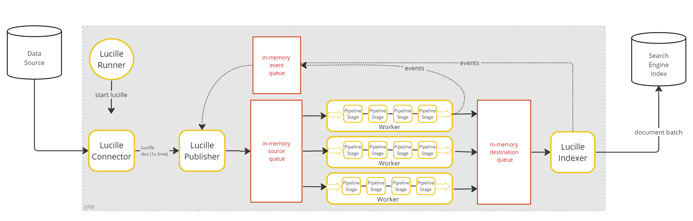
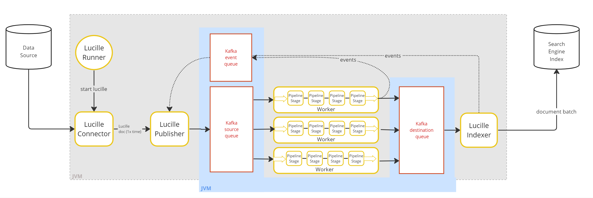
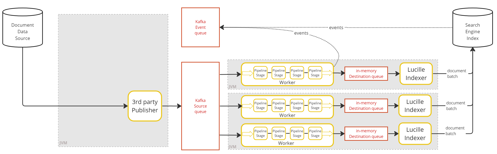

## Batch and Streaming Models

The pages so far have described Lucille in terms of a **batch ingest**: a bounded run where a Connector reads a finite dataset to completion, the Publisher tracks every document through to a terminal state, and the run ends when all work is done.

Lucille also supports a **streaming model** for unbounded, continuous ingestion. In a streaming scenario, documents arrive continuously from an external source and need to be processed and indexed as they arrive. There is no run boundary, no completion accounting, and no Connector lifecycle — the stream simply flows.

From an architectural standpoint, the streaming model is a straightforward variation of the batch model. Because Lucille is a queue-based system, the Connector's role can be taken over by an external producer that writes documents directly to the processing queue (a Kafka topic). Workers consume from that topic and process documents exactly as they would in batch mode. The rest of the system — Workers writing to an indexing queue, Indexers reading from it and sending batches to the search backend — functions identically.

Crucially, the pipeline stages themselves are unaware of which model they are running under. A Stage that extracts entities or generates embeddings does not know or care whether it is processing a bounded batch or an unbounded stream. This means you can develop and test pipeline logic in batch mode — where the accounting and test infrastructure make correctness verification straightforward — and then deploy the same pipeline in streaming mode for real-time production ingestion.

## The WorkerIndexer: A Practical Middle Ground

In the fully distributed deployment, Workers and Indexers run as separate JVM processes connected by a Kafka topic. This maximizes flexibility — each fleet can be scaled independently — but it adds a Kafka round-trip between Worker output and Indexer input.

As a practical simplification, Lucille provides the **WorkerIndexer**: a single JVM process that pairs a Worker with a co-located Indexer. The Worker reads from Kafka and writes processed documents to an in-memory queue; the paired Indexer reads from that in-memory queue and sends to the search backend. This eliminates the Worker-to-Indexer Kafka round-trip while retaining horizontal scaling — you can run as many WorkerIndexer processes as needed, and Kafka's consumer group protocol distributes partitions across them automatically.

The WorkerIndexer is a useful middle ground between the fully local single-JVM deployment and the fully distributed model with independent Worker and Indexer fleets. It is the recommended starting point for distributed deployments that do not require separate Worker and Indexer scaling.

## Worker Processes and Worker Threads

There are two independent knobs for scaling enrichment throughput, and it is important to distinguish them.

A **Worker process** is a JVM process running Lucille's Worker component. In distributed deployments, multiple Worker processes can be launched on separate machines, all consuming from the shared Kafka processing topic.

Within each Worker process, a **Worker thread** is a single thread executing the pipeline — and each Worker thread is also an independent Kafka consumer. The Kafka `poll()` call happens inside the thread, so each thread fetches and processes documents directly from the topic. Kafka's consumer group protocol assigns partitions across all active consumer threads, summed across all Worker processes. A Worker process runs a configurable number of Worker threads (`worker.threads`), each with its own independent Pipeline instance — its own copy of every Stage, with its own connections, models, and any other stateful resources. Because Stage instances are never shared across threads, they require no synchronization.

The two knobs compose: to maximize throughput, scale out with more Worker processes across machines, and scale up with more Worker threads within each process. One constraint applies: the total number of Worker threads across all processes should not exceed the number of partitions in the Kafka source topic, since Kafka cannot assign a partition to more than one consumer in the same group — excess threads would sit idle. The same distinction applies to WorkerIndexer processes, where each process contains a Worker thread pool paired with an Indexer.

---

For the commands to start each mode in production, see [Production Deployment]().

## Local Modes

In local modes (also called single-node or standalone modes), all Lucille components run as threads in a single JVM process. Lucille supports two local modes.

### Local

All components run as threads in one JVM. Inter-component communication uses in-memory queues. No external dependencies required.

### Kafka Local

All components still run as threads in one JVM, but inter-component communication uses an external Kafka instance instead of in-memory queues. Useful for testing Kafka integration without deploying separate processes.

## Distributed Modes

Distributed modes are how Lucille scales horizontally. Kafka provides message persistence and fault tolerance, and each Lucille component type runs as one or more separate JVM processes.

### Fully Distributed

> *Best for batch ingest architecture.*

The Connector/Publisher, Workers, and Indexers each run as separate JVM processes. All inter-component communication flows through Kafka topics. Workers and Indexers send lifecycle events to a Kafka event topic, which the Publisher polls to track completion.

### Connector-less Distributed

> *Best for streaming ingest architecture.*

Like Fully Distributed, but with no Lucille Connector or Publisher. An external system writes documents directly to the Kafka source topic, where Workers pick them up. Because there is no Publisher, there is no run-completion accounting — this mode is intended for unbounded streaming workloads.

If events are enabled, the external publisher must stamp each document with a `run_id`.

### Hybrid

> *Best for streaming update architecture.*

Like Connector-less Distributed, but each Worker is paired with a co-located Indexer in the same JVM (a WorkerIndexer). Workers read from a Kafka source topic and write processed documents to an in-memory queue; the paired Indexer reads from that queue and sends to the search backend. This eliminates one Kafka round-trip per document compared to Fully Distributed.

