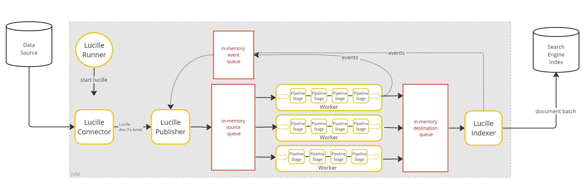
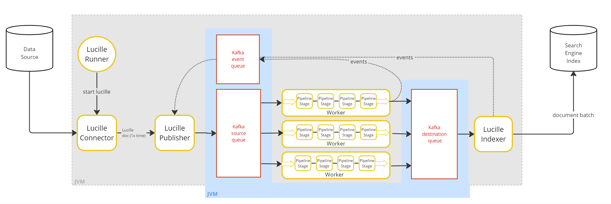
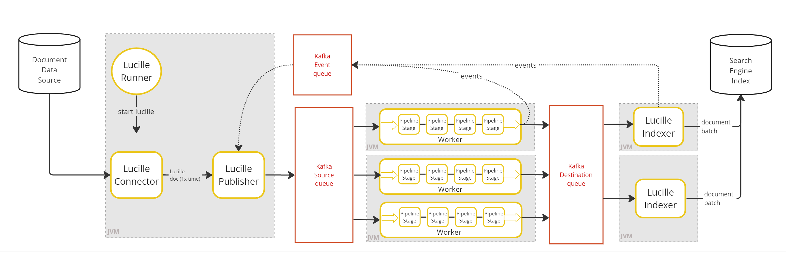
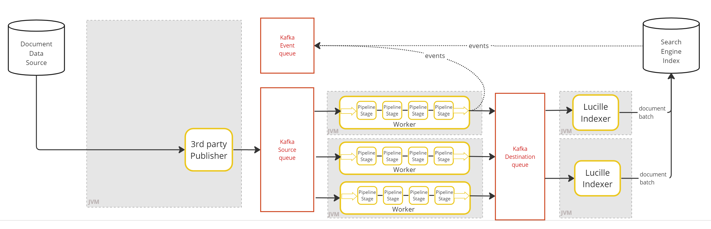
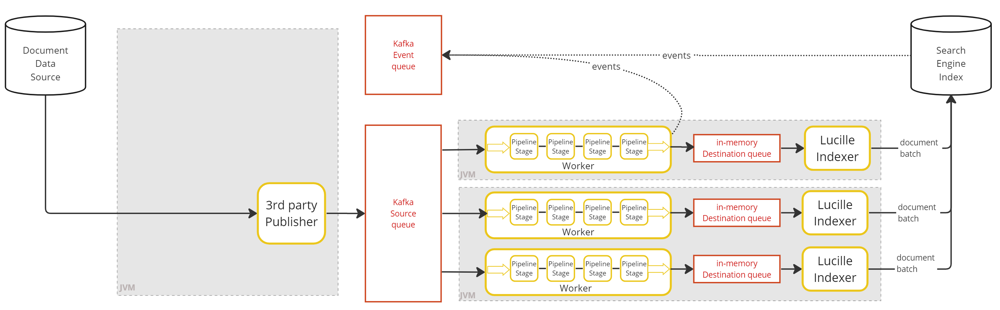

## Local Development Modes
Alternatively referred to as standalone modes or single-node modes. 
In local mode, all Lucille components are running in a single thread Java Process (JVM).  
Lucille supports two types of local modes: Local or Kafka Local. 

### Local 
A single process in the JVM. Intra-component (thread) communication is via an in-memory queue. 

### Kakfa Local 
A single process in the JVM, with the exception of an externalized instance of Kafka. Intra-component (thread) communication is via Kafka.

## Distributed Modes
Distributed modes are how Lucille scales. Kafka is utilized for message persistance/fault tolerance, and Lucille components run as multiple separate Java processes.

### Fully Distributed
> *Best for batch ingest architecture.* 

Connector/Publisher, Workers, and Indexers are all separate processes running in their own JVM. Intra-component communication is via externalized Kafka topics/queues. Events are being sent from the workers and indexers to a Kafka event topic. The events are being read by the Lucille Publisher.

### Connector-less Distributed
> *Best for incremental ingest architecture.*

Similar to Fully Distributed Mode, but as the name implies, there is no Lucille Connector or Publisher. Instead, this mode supports an arbitrary 3rd party “publisher” feeding documents onto a Kafka Source queue - where the documents are then picked up by worker threads.

In this mode, events may be enabled and sent to a Kafka Event queue. In order to send events, the 3rd party publisher would be responsible for creating a run ID and stamping documents with this ID.

### Hybrid
>  *Best for streaming update architecture.*

Similar to Connector-less Distibuted Mode. However, in hybrid mode worker threads are reading from a source Kafka topic and publishing to an in-memory queue read by a worker-indexer (an indexer paired with a worker).

