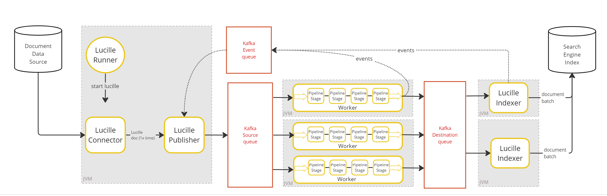
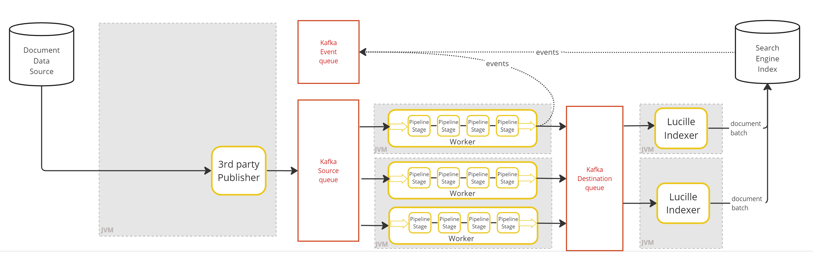

For the commands to start each mode in production, see [Production Deployment]().

## Local Modes

In local modes (also called single-node or standalone modes), all Lucille components run as threads in a single JVM process. Lucille supports two local modes.

### Local

All components run as threads in one JVM. Inter-component communication uses in-memory queues. No external dependencies required.

### Kafka Local

All components still run as threads in one JVM, but inter-component communication uses an external Kafka instance instead of in-memory queues. Useful for testing Kafka integration without deploying separate processes.

## Distributed Modes

Distributed modes are how Lucille scales horizontally. Kafka provides message persistence and fault tolerance, and each Lucille component type runs as one or more separate JVM processes.

### Fully Distributed

> *Best for batch ingest architecture.*

The Connector/Publisher, Workers, and Indexers each run as separate JVM processes. All inter-component communication flows through Kafka topics. Workers and Indexers send lifecycle events to a Kafka event topic, which the Publisher polls to track completion.

### Connector-less Distributed

> *Best for streaming ingest architecture.*

Like Fully Distributed, but with no Lucille Connector or Publisher. An external system writes documents directly to the Kafka source topic, where Workers pick them up. Because there is no Publisher, there is no run-completion accounting — this mode is intended for unbounded streaming workloads.

If events are enabled, the external publisher must stamp each document with a `run_id`.

### Hybrid

> *Best for streaming update architecture.*

Like Connector-less Distributed, but each Worker is paired with a co-located Indexer in the same JVM (a WorkerIndexer). Workers read from a Kafka source topic and write processed documents to an in-memory queue; the paired Indexer reads from that queue and sends to the search backend. This eliminates one Kafka round-trip per document compared to Fully Distributed.

