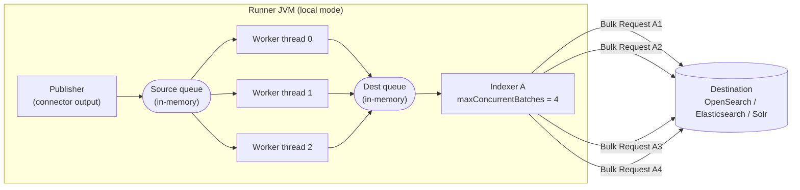
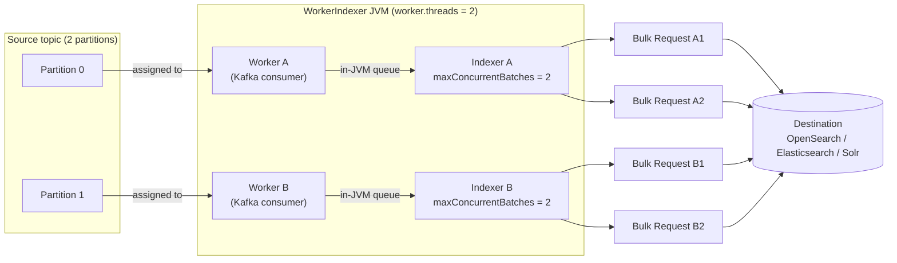
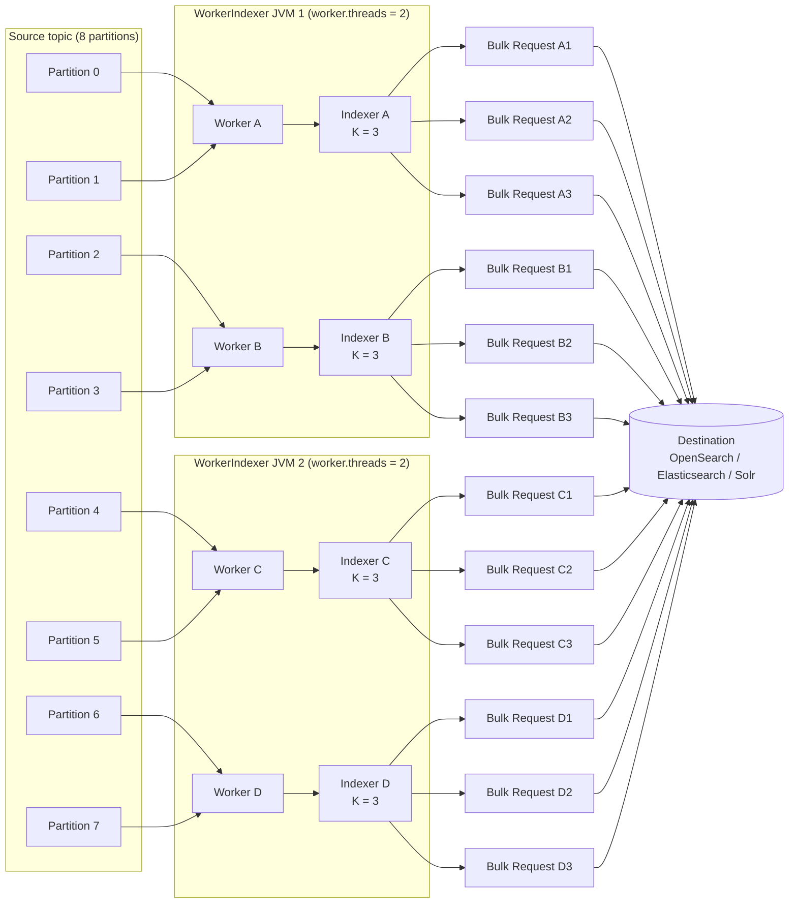
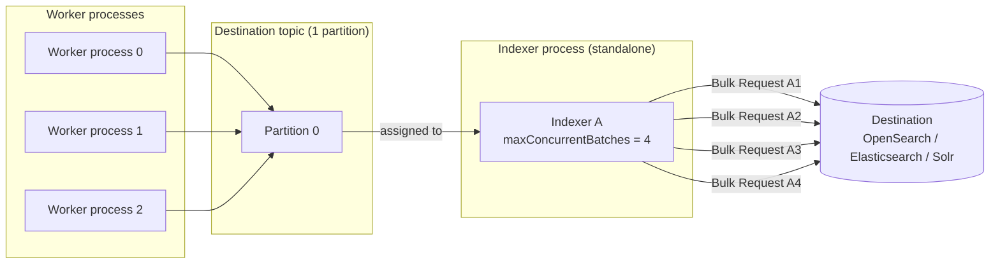
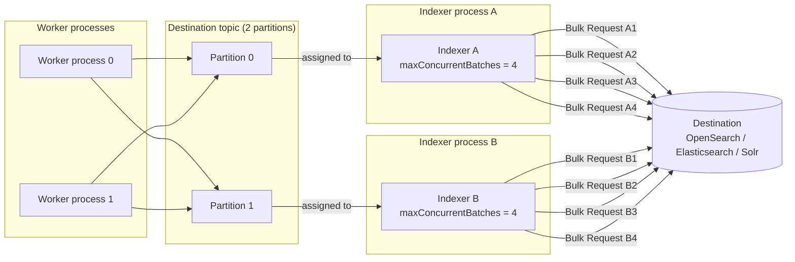

These diagrams show how Lucille overlaps bulk requests against the search
destination, and how that concurrency fans out across threads, JVMs, and processes.
They correspond to the levers described on the [Indexing Throughput]()
page: larger batches, more consumers, and more sending threads per consumer
(`indexer.maxConcurrentBatches`, shown here as K).

Two kinds of concurrency combine in every deployment:

- **Across consumers** - more indexers (local worker/indexer threads, hybrid
  `WorkerIndexer` threads, or standalone distributed indexer processes) each send
  their own bulk requests, and those requests overlap with the other consumers'.
- **Within a consumer** - a single indexer with `maxConcurrentBatches` greater than
  1 keeps several of its own bulk requests in flight at once, on its own small pool
  of send threads.

The total send concurrency against the destination is the product of the two:
roughly `consumers x K` bulk requests in flight (and a comparable amount of
connection load), which is the number to size against the destination's write
capacity.

The scenarios below cover each deployment mode: **local** (one JVM, in-memory
queues, a single indexer), **hybrid** (`WorkerIndexer` threads reading a source
topic), and **fully distributed** (separate worker and indexer processes connected
through a destination topic).

## Local mode

In local mode there is no Kafka. The Runner launches the publisher, the pipeline
workers, and a single indexer as threads in one JVM, all sharing a `LocalMessenger`
that holds two in-memory queues: a **source queue** (publisher to workers) and a
**dest queue** (workers to indexer). Multiple worker threads pull from the source
queue and push processed documents to the dest queue; the one indexer thread polls
the dest queue and sends to the destination. `maxConcurrentBatches` (K) is the only
lever that overlaps sends here, since there is a single indexer and no partitions.

### Local mode: 1 JVM, multiple worker threads, 1 indexer, K = 4

## Hybrid mode

In hybrid mode each `WorkerIndexer` thread pairs a **worker** (the Kafka consumer,
subscribed to the **source** topic) with an **indexer** (which sends bulk requests
to the destination). The source topic's partition count gates how many threads can
be active across the consumer group; `maxConcurrentBatches` (K) is per indexer, so
aggregate send concurrency and connection load are `threads x K`.

### Simple case: 1 JVM, 2 threads, K = 2

Source topic with 2 partitions, one WorkerIndexer JVM running `worker.threads: 2`,
each indexer at `maxConcurrentBatches: 2`. Total in flight from the JVM:
2 threads x 2 = **4 concurrent bulk requests**.

### Scaled case: 2 JVMs, 2 threads each, 8 partitions, K = 3

Source topic with 8 partitions, two WorkerIndexer JVMs running `worker.threads: 2`
each (4 threads total), each indexer at `maxConcurrentBatches: 3`. Because there are
more partitions than threads, Kafka assigns **multiple partitions to each worker** -
here each worker owns 2 partitions and feeds them to its one paired indexer.

Each arrow from a partition to a worker is a partition assignment; each `Bulk Request`
box is one in-flight bulk send, labeled with its indexer (A-D) and the request's slot
within that indexer. Every indexer has K = 3 of them in flight at once. Send concurrency is set by the thread count and K, not the
partition count: 4 threads x 3 = **12 concurrent bulk requests**. The extra partitions
add headroom to scale *out* later (up to 8 threads) without repartitioning.

## Fully distributed mode

In distributed mode the workers and indexers run as separate processes, connected
through Kafka. The workers consume the source topic and publish processed documents
to the **destination topic**; the standalone indexers are the Kafka consumers of the
destination topic. The destination topic's partition count caps how many indexers can
be active, and `maxConcurrentBatches` (K) overlaps sends within each indexer.

### Case 1: single-partition destination topic, one indexer with concurrent sends

Several worker processes publish to a destination topic that has **one** partition.
Only one indexer in the consumer group can be assigned that partition, so a single
indexer consumes everything. Adding more indexer processes yields no send parallelism
(they sit idle). `maxConcurrentBatches` is the only lever that overlaps sends - the
same situation that the delete-by-query constraint forces.

### Case 2: 2-partition destination topic, two indexer processes with concurrent sends

The destination topic has **2** partitions, so two standalone indexer processes can
each be assigned one partition and consume concurrently. Each indexer additionally
overlaps its own sends with `maxConcurrentBatches`. Total in flight:
2 indexers x K = **8 concurrent bulk requests** at K = 4.

