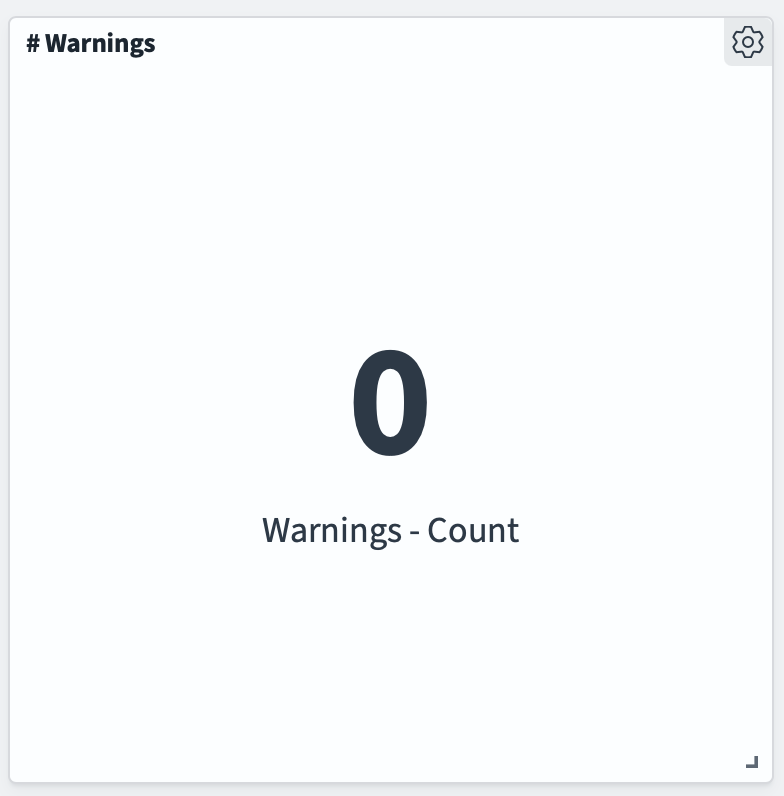
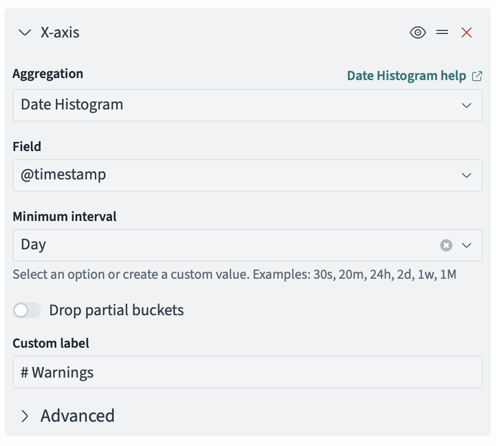
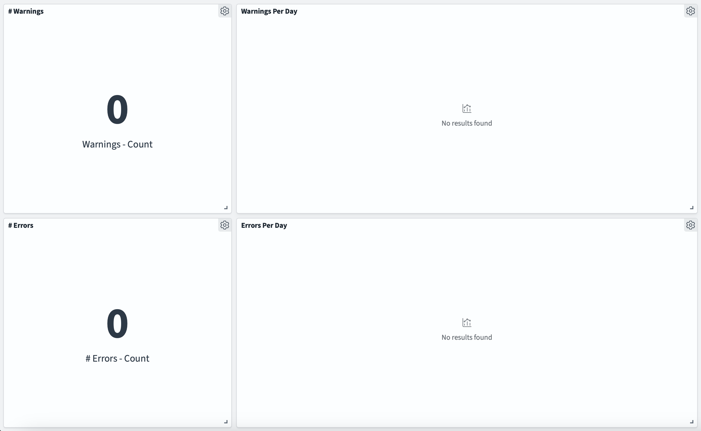

## Lucille Logs

**There are many ways you can use the logs output by Lucille.** Lucille has, essentially, two main loggers for tracking your Lucille run: 
the `Root` logger, and the `DocLogger`. 

### The Root Logger
The `Root` logger outputs log statements from a variety of sources, allowing you to track your Lucille run. For example, the `Root` logger
is where you'll get intermittent updates about your pipeline's performance, warnings from Stages or Indexers in certain situations, etc.

### The Doc Logger
The `DocLogger` is very verbose - it tracks the lifecycle of _each Document_ in your Lucille pipeline.
For example, a log statement is made when a Document is created, before it is published, before & after a Stage operates on it... etc. 
As you can imagine, this results in _many_ log statements - it is recommended these logs are stored in a file, rather than just
having them printed to the console.
Logs from the `DocLogger` will primarily be `INFO`-level logs - very rarely, an `ERROR`-level log will be made for a Document.

## Log Files
Lucille can store logs in a file as plain text or as JSON objects. When storing logs as JSON, each line will be a JSON object representing
a log statement in accordance with the `EcsLayout`. By modifying the `log4j2.xml`, you can control which Loggers are enabled/disabled,
where their logs get stored, and what level of logs you want to process.

## Logstash & OpenSearch
If you store your logs as JSON, you can easily run Logstash on the file(s), allowing you to index them into a Search Engine of your
choice for enhanced discovery and analysis. This can be particularly informative when working with the `DocLogger`. For example,
you might:
* Trace a specific Document's lifecycle by querying by the Document's ID.
* Using the Timestamp of the logs, track the performance of your Lucille pipeline and identify potential bottlenecks.
* Create Dashboards, allowing you to monitor your pipeline for potential warnings / errors for a repeated Lucille run.

Here is an example `pipeline.conf` for ingesting your Lucille logs into a local OpenSearch instance:

```
input {
  file {
    path => "/lucille/lucille-examples/lucille-simple-csv-solr-example/log/com.kmwllc.lucille-json*"
    mode => "read"
    codec => "json"
    start_position => "beginning"
    sincedb_path => "/dev/null"
    exit_after_read => "true"
  }
}
output {
  stdout {
    codec => rubydebug
  }
  opensearch {
    hosts => "http://localhost:9200"
    index => "logs"
    ssl_certificate_verification => false
    ssl => false
  }
}
```

Note that this pipeline will delete the log files after they are ingested. And, SSL is disabled.

Here are some queries you might run (using curl):

```
curl -XGET "http://localhost:9200/logs/_search" -H 'Content-Type: application/json' -d '{
  "query": {
    "term": {
      "id.keyword": "songs.csv-1"
    }
  }
}'
```

This query will only return log statements where the id of the Document being processed is "songs.csv-1", a Document ID
from the Lucille Simple CSV example. This allows you to easily track the lifecycle of the Document as it was processed and published.

```
curl -XGET "http://localhost:9200/logs/_search" -H 'Content-Type: application/json' -d '{
  "query": {
    "match": {
      "message": "FileHandler"        
    }
  }
}'
```

This query will return log statements with "FileHandler" in the message. This allows you to track specifically when Documents were
created from a JSON, CSV, or XML FileHandler.

### OpenSearch Dashboards

By filling an OpenSearch Index with your JSON log statements, you can also build OpenSearch Dashboards to monitor your Lucille runs 
and analyze their performance. 

### Setting up the Index Pattern

Once you have OpenSearch Dashboards open, click on the menu in the top left. Select **Dashboards Management**, and then, on this new
page, select **Index Patterns**. Create an Index Pattern for your **logs** index. As you click through, be sure to choose **@Timestamp**
in the dropdown for "Time Field". 

(Timestamps are very important in OpenSearch Dashboards. Many features will use the timestamp of a Document in some form.)

### Discovery

OpenSearch Dashboards has two major "features" - **Dashboards** and **Discover**. We'll start with **Discover**. 

At the top right of the screen, you'll see a time range. Only logs within this time range will be shown. It defaults to only include
logs within the last 15 minutes, so you'll likely need to change it. Set **absolute** time ranges that cover your Lucille run. (The UI
for setting these times can be a bit finicky, but keep trying.)

Like before, we can trace the entire lifecycle of a single Document. In the search bar, type in: `id:"songs.csv-1"`. Now, you
should only see the log statements relevant to this Document. Each entry will be a large blob of text representing the entire Document.
You can select certain fields on the left side of your screen to get a more focused view of each statement. 

You can also sort the statements in a certain order. If you hover over **Time** at the top of the table, you can click the arrow to
sort the logs by their timestamps.

### Dashboards

Now, let's see how Dashboards could help you monitor a certain Lucille run. Imagine you have scheduled a Lucille run to execute
every day. We can create a Dashboard that will help us quickly see how many warnings/errors took place. 

Click **add** in the top right to create a new panel. Click **+ Create new**, then choose visualization, and then **metric**. Choose
your logs index as the source. 

In this new window, for metric, click buckets. Choose a `Filters` aggregation, and in the filter, include `log.level:"WARN"` (using
Dashboards Query Language). This will display the number of log statements with a level of "WARN".



You can then repeat this process, but for logs with a level of `ERROR`.

Now, let's make a chart that'll display the number of warnings **per day**. Create a new visualization - this time, a **vertical bar**.
Go to buckets, and add `X-axis`. Configure it like this:



Then, add another bucket - a split series. Configure it just like the panel - a **Filters** aggregation, with `log.level:"WARN"`.
Now you'll have a chart tracking the number of warnings per day. And, again, you can do the same for `ERROR`-level logs.

Your dashboard might look a little something like this (but populated with a little bit of actual data):

